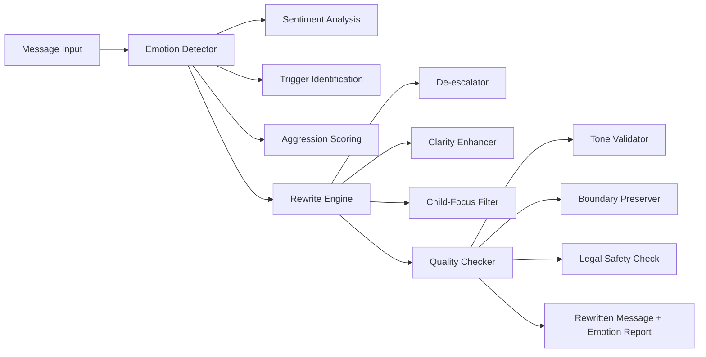

# 🧠 Emotional Intelligence AI for Legal Communication — Reduce Conflict, Improve Outcomes


## The Problem

Legal communication — especially in family law — is emotionally charged. Aggressive, inflammatory, or unclear messages escalate conflict, harm children, and undermine court credibility. Co-parents send hostile emails. Parties file motions dripping with contempt. Mediators waste hours de-escalating before any progress can be made.

The emotional toll is staggering: children caught in the crossfire, cases that drag on for years, and outcomes that leave everyone worse off.

## The Solution

AI that rewrites messages to be less aggressive, more clear, and child-centered. It detects emotional triggers, suggests de-escalation, and produces court-neutral communication — all while preserving the sender's meaning and firm boundaries.

Think of it as a translator between "what you feel" and "what the court needs to hear."



## Who This Helps

- **Co-parents in conflict** — communicate without escalating
- **Family law attorneys** — coach clients on effective communication
- **Mediators** — pre-process communications before sessions
- **Guardian ad litem** — ensure child-centered language
- **Domestic violence advocates** — maintain safety while communicating

## Features

- **Aggression and hostility detection** — identify hostile language, threats, and passive aggression
- **Automatic de-escalation rewriting** — rewrite messages to reduce conflict while preserving meaning
- **Child-centered language enforcement** — reframe adult conflicts around children's needs
- **Boundary preservation** — keep firm boundaries in place without aggression
- **Court-readiness scoring** — score messages for court appropriateness (0-100)
- **Emotional trigger identification** — find inflammatory language, manipulation, and threats
- **Multiple tone options** — neutral, warm, or firm rewrites depending on context

## Quick Start

```bash
npm install @justice-os/emotional-ai
```

```typescript
import { EmotionDetector, RewriteEngine } from '@justice-os/emotional-ai';

// Detect emotions in a hostile message
const detector = new EmotionDetector();
const analysis = await detector.analyze(
  "You NEVER let me see the kids and you know it. You're a terrible parent."
);

console.log(analysis.aggressionScore);  // 82
console.log(analysis.triggers);         // ['accusation', 'absolute_language', 'personal_attack']

// Rewrite with de-escalation
const rewriter = new RewriteEngine({ tone: 'neutral' });
const result = await rewriter.rewrite(
  "You NEVER let me see the kids and you know it. You're a terrible parent."
);

console.log(result.rewritten);
// "I would like to discuss adjusting the parenting schedule.
//  I feel that my time with the children has been limited recently
//  and would appreciate the opportunity to find a solution together."

console.log(result.courtReadinessScore); // 91
```

## Roadmap

| Phase | Feature | Status |
|-------|---------|--------|
| 1 | Core emotion detection engine | 🟡 In Progress |
| 1 | Aggression scoring system | 🟡 In Progress |
| 2 | De-escalation rewrite engine | 📋 Planned |
| 2 | Child-focus filter | 📋 Planned |
| 3 | Court-readiness scoring | 📋 Planned |
| 3 | Tone selector (neutral/warm/firm) | 📋 Planned |
| 4 | React components for message rewriting | 📋 Planned |
| 4 | Batch processing for case files | 📋 Planned |

## Architecture

See [docs/architecture.md](docs/architecture.md) for system design and Mermaid diagrams.

## Data Model

See [docs/data-model.md](docs/data-model.md) for entity relationship diagrams.

## Contributing

See [CONTRIBUTING.md](CONTRIBUTING.md) for guidelines.

---

## Justice OS Ecosystem

This repository is part of the **Justice OS** open-source ecosystem — 32 interconnected projects building the infrastructure for accessible justice technology.

### Core System Layer
| Repository | Description |
|-----------|-------------|
| [justice-os](https://github.com/dougdevitre/justice-os) | Core modular platform — the foundation |
| [justice-api-gateway](https://github.com/dougdevitre/justice-api-gateway) | Interoperability layer for courts |
| [legal-identity-layer](https://github.com/dougdevitre/legal-identity-layer) | Universal legal identity and auth |
| [case-continuity-engine](https://github.com/dougdevitre/case-continuity-engine) | Never lose case history across systems |
| [offline-justice-sync](https://github.com/dougdevitre/offline-justice-sync) | Works without internet — local-first sync |

### User Experience Layer
| Repository | Description |
|-----------|-------------|
| [justice-navigator](https://github.com/dougdevitre/justice-navigator) | Google Maps for legal problems |
| [mobile-court-access](https://github.com/dougdevitre/mobile-court-access) | Mobile-first court access kit |
| [cognitive-load-ui](https://github.com/dougdevitre/cognitive-load-ui) | Design system for stressed users |
| [multilingual-justice](https://github.com/dougdevitre/multilingual-justice) | Real-time legal translation |
| [voice-legal-interface](https://github.com/dougdevitre/voice-legal-interface) | Justice without reading or typing |
| [legal-plain-language](https://github.com/dougdevitre/legal-plain-language) | Turn legalese into human language |

### AI + Intelligence Layer
| Repository | Description |
|-----------|-------------|
| [vetted-legal-ai](https://github.com/dougdevitre/vetted-legal-ai) | RAG engine with citation validation |
| [justice-knowledge-graph](https://github.com/dougdevitre/justice-knowledge-graph) | Open data layer for laws and procedures |
| [legal-ai-guardrails](https://github.com/dougdevitre/legal-ai-guardrails) | AI safety SDK for justice use |
| [emotional-intelligence-ai](https://github.com/dougdevitre/emotional-intelligence-ai) | Reduce conflict, improve outcomes |
| [ai-reasoning-engine](https://github.com/dougdevitre/ai-reasoning-engine) | Show your work for AI decisions |

### Infrastructure + Trust Layer
| Repository | Description |
|-----------|-------------|
| [evidence-vault](https://github.com/dougdevitre/evidence-vault) | Privacy-first secure evidence storage |
| [court-notification-engine](https://github.com/dougdevitre/court-notification-engine) | Smart deadline and hearing alerts |
| [justice-analytics](https://github.com/dougdevitre/justice-analytics) | Bias detection and disparity dashboards |
| [evidence-timeline](https://github.com/dougdevitre/evidence-timeline) | Evidence timeline builder |

### Tools + Automation Layer
| Repository | Description |
|-----------|-------------|
| [court-doc-engine](https://github.com/dougdevitre/court-doc-engine) | TurboTax for legal filings |
| [justice-workflow-engine](https://github.com/dougdevitre/justice-workflow-engine) | Zapier for legal processes |
| [pro-se-toolkit](https://github.com/dougdevitre/pro-se-toolkit) | Self-represented litigant tools |
| [justice-score-engine](https://github.com/dougdevitre/justice-score-engine) | Access-to-justice measurement |
| [justice-app-generator](https://github.com/dougdevitre/justice-app-generator) | No-code builder for justice tools |

### Quality + Testing Layer
| Repository | Description |
|-----------|-------------|
| [justice-persona-simulator](https://github.com/dougdevitre/justice-persona-simulator) | Test products against real human realities |
| [justice-experiment-lab](https://github.com/dougdevitre/justice-experiment-lab) | A/B testing for justice outcomes |

### Adoption Layer
| Repository | Description |
|-----------|-------------|
| [digital-literacy-sim](https://github.com/dougdevitre/digital-literacy-sim) | Digital literacy simulator |
| [legal-resource-discovery](https://github.com/dougdevitre/legal-resource-discovery) | Find the right help instantly |
| [court-simulation-sandbox](https://github.com/dougdevitre/court-simulation-sandbox) | Practice before the real thing |
| [justice-components](https://github.com/dougdevitre/justice-components) | Reusable component library |
| [justice-dev-starter-kit](https://github.com/dougdevitre/justice-dev-starter-kit) | Ultimate boilerplate for justice tech builders |

> Built with purpose. Open by design. Justice for all.


---

### ⚠️ Disclaimer

This project is provided for **informational and educational purposes only** and does **not** constitute legal advice, legal representation, or an attorney-client relationship. No warranty is made regarding accuracy, completeness, or fitness for any particular legal matter. **Always consult a licensed attorney** in your jurisdiction before making legal decisions. Use of this software does not create any professional-client relationship.

---

### Built by Doug Devitre

I build AI-powered platforms that solve real problems. I also speak about it.

**[CoTrackPro](https://cotrackpro.com)** · admin@cotrackpro.com

→ **Hire me:** AI platform development · Strategic consulting · Keynote speaking

> *AWS AI/Cloud/Dev Certified · UX Certified (NNg) · Certified Speaking Professional (NSA)*
> *Author of Screen to Screen Selling (McGraw Hill) · 100,000+ professionals trained*
