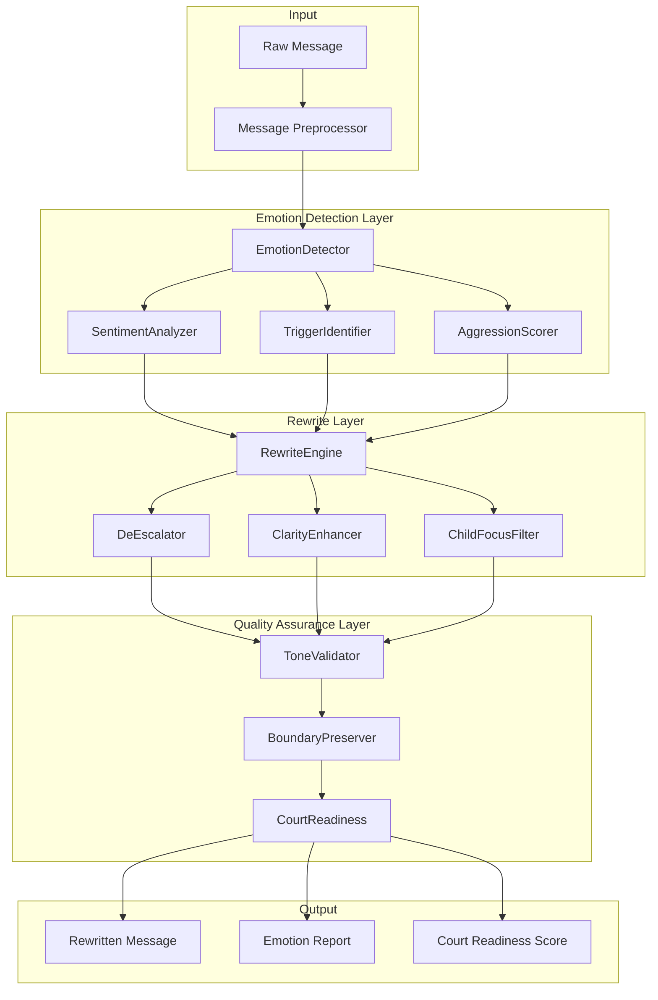
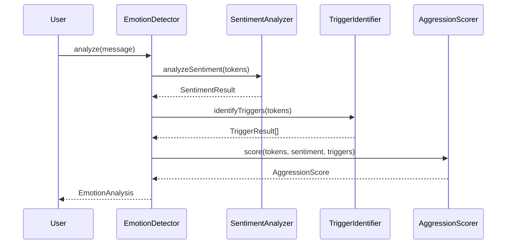
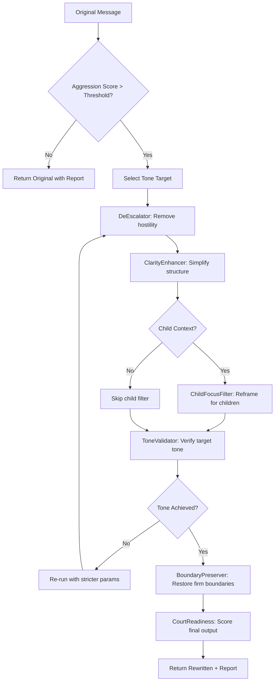
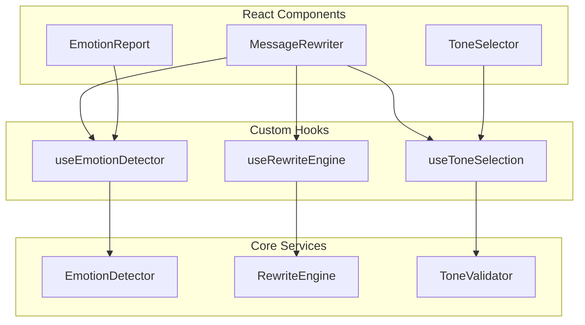
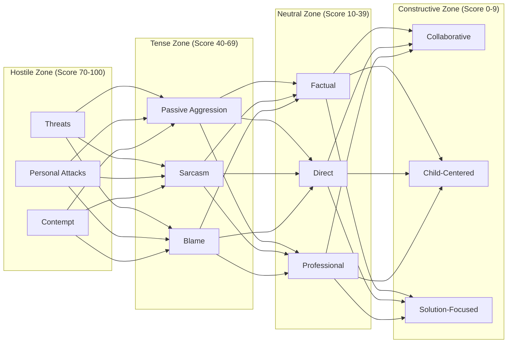

# Architecture — Emotional Intelligence AI

## System Overview

```mermaid
graph TB
    subgraph Input
        A[Raw Message] --> B[Message Preprocessor]
    end

    subgraph Detection["Emotion Detection Layer"]
        B --> C[EmotionDetector]
        C --> D[SentimentAnalyzer]
        C --> E[TriggerIdentifier]
        C --> F[AggressionScorer]
    end

    subgraph Rewriting["Rewrite Layer"]
        D & E & F --> G[RewriteEngine]
        G --> H[DeEscalator]
        G --> I[ClarityEnhancer]
        G --> J[ChildFocusFilter]
    end

    subgraph Quality["Quality Assurance Layer"]
        H & I & J --> K[ToneValidator]
        K --> L[BoundaryPreserver]
        L --> M[CourtReadiness]
    end

    subgraph Output
        M --> N[Rewritten Message]
        M --> O[Emotion Report]
        M --> P[Court Readiness Score]
    end
```

## Detection Pipeline

```mermaid
sequenceDiagram
    participant User
    participant Detector as EmotionDetector
    participant Sentiment as SentimentAnalyzer
    participant Trigger as TriggerIdentifier
    participant Aggression as AggressionScorer

    User->>Detector: analyze(message)
    Detector->>Sentiment: analyzeSentiment(tokens)
    Sentiment-->>Detector: SentimentResult
    Detector->>Trigger: identifyTriggers(tokens)
    Trigger-->>Detector: TriggerResult[]
    Detector->>Aggression: score(tokens, sentiment, triggers)
    Aggression-->>Detector: AggressionScore
    Detector-->>User: EmotionAnalysis
```

## Rewrite Flow

```mermaid
flowchart TD
    A[Original Message] --> B{Aggression Score > Threshold?}
    B -->|No| C[Return Original with Report]
    B -->|Yes| D[Select Tone Target]
    D --> E[DeEscalator: Remove hostility]
    E --> F[ClarityEnhancer: Simplify structure]
    F --> G{Child Context?}
    G -->|Yes| H[ChildFocusFilter: Reframe for children]
    G -->|No| I[Skip child filter]
    H --> J[ToneValidator: Verify target tone]
    I --> J
    J --> K{Tone Achieved?}
    K -->|No| L[Re-run with stricter params]
    K -->|Yes| M[BoundaryPreserver: Restore firm boundaries]
    M --> N[CourtReadiness: Score final output]
    N --> O[Return Rewritten + Report]
    L --> E
```

## Component Architecture

```mermaid
graph TB
    subgraph React["React Components"]
        A[MessageRewriter]
        B[EmotionReport]
        C[ToneSelector]
    end

    subgraph Hooks["Custom Hooks"]
        D[useEmotionDetector]
        E[useRewriteEngine]
        F[useToneSelection]
    end

    subgraph Core["Core Services"]
        G[EmotionDetector]
        H[RewriteEngine]
        I[ToneValidator]
    end

    A --> D & E & F
    B --> D
    C --> F
    D --> G
    E --> H
    F --> I
```

## Tone Spectrum Model

```mermaid
graph LR
    subgraph Aggressive["Hostile Zone (Score 70-100)"]
        A1[Threats]
        A2[Personal Attacks]
        A3[Contempt]
    end

    subgraph Tense["Tense Zone (Score 40-69)"]
        B1[Passive Aggression]
        B2[Sarcasm]
        B3[Blame]
    end

    subgraph Neutral["Neutral Zone (Score 10-39)"]
        C1[Factual]
        C2[Direct]
        C3[Professional]
    end

    subgraph Constructive["Constructive Zone (Score 0-9)"]
        D1[Collaborative]
        D2[Child-Centered]
        D3[Solution-Focused]
    end

    A1 & A2 & A3 --> B1 & B2 & B3
    B1 & B2 & B3 --> C1 & C2 & C3
    C1 & C2 & C3 --> D1 & D2 & D3
```
