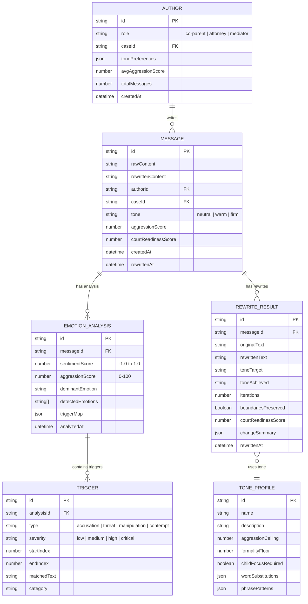

# Data Model — Emotional Intelligence AI

## Entity Relationship Diagram

## Key Entities

### Message
The central entity — a piece of communication (email, text, filing excerpt) submitted for analysis and potential rewriting.

### EmotionAnalysis
The result of running the EmotionDetector on a message. Contains sentiment scores, aggression levels, and dominant emotions.

### Trigger
A specific inflammatory or problematic phrase identified within a message. Includes the matched text, its type, and severity.

### RewriteResult
The output of the RewriteEngine, containing the rewritten text, tone details, and quality metrics.

### ToneProfile
A configuration template that defines how a particular tone (neutral, warm, firm) should read — word substitutions, formality levels, and constraints.

### Author
Tracks communication patterns for an individual within a case, enabling personalized de-escalation strategies over time.
